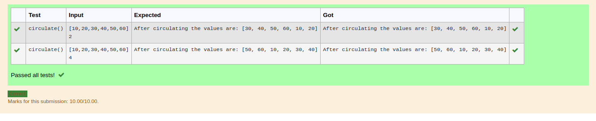

# Circulate-the-values-of-N-variables
## Aim:
To write a python program to circulate the n variables using function concept
## Equipment’s required:
PC
Anaconda - Python 3.7
## Algorithm: 

### Step 1: 
import numpy
### Step 2:
get the input 
### Step 3: 
Get the value from the user for the number of rotation
### Step 4: 
Using the slicing concept rotate the list
### Step 5: 
print the reult
### Step 6:
END THE PROGRAM
## Program:
```python
#Program to circulate N values.
#Developed by:SACHIN.C
#RegisterNumber:22001187
def circulate():
    a=eval(input())
    n=int(input())
    a=a[n:]+a[:n]
    print("After circulating the values are:",a)
```
## Output:


## Result:
Thus,the circulation of the values of the N variables are solved using python programming.